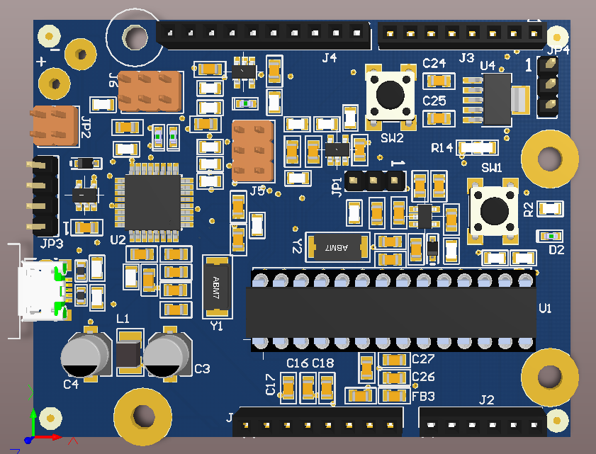

# Arduino-Uno-Mod
A modified schematic for the Arduino Uno Board  
- The circuit was modified with more hand soldering friendly components. 
- Micro usb type B is directly used instead of the bulky usb-B.  
- A user button is added which can be really handy instead of connecting one externally.  
- Power beads were also used for improved noise damping in power lines.
  
The Top view of the board:    
  

And the bottom view:
 
